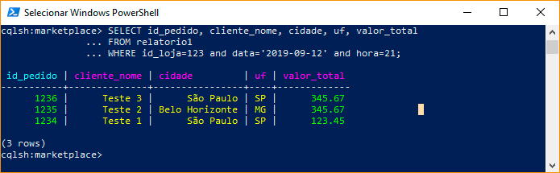
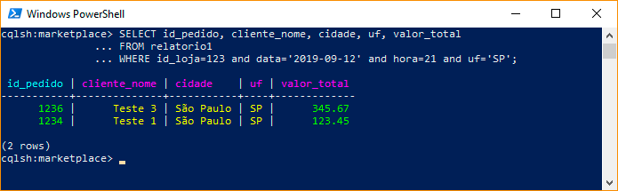
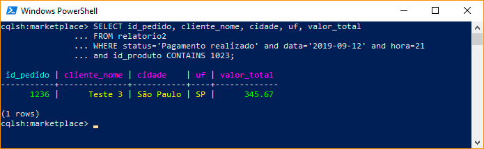
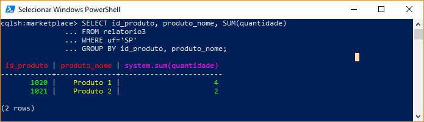

# Trabalho Cassandra

**334409 - Charles Guimarães Cavalcante**

Nossa plataforma de marketplace, deseja realizar algumas analises e relatórios sobre as vendas, produtos e lojas em tempo real (Near Real Time). 
Dado o grande volume de informaçôes que serâo armazenadas, o Volume de escrita que será superior ao de leitura e forte necessídade de baixo tempo de resposta, 
como responsaveis pela arquitetura dessa estrutura, vocês definiram o Cassandra como solução de armazenamento de Dados.

---

### 1) Pedidos realizados na ultima hora por loja:

Criação da tabela **relatorio1**, com uma partição primária composta pelo id da loja, data e hora. A clusterização mantém os dados em ordem inversa de pedido para retornar rapidamente os últimos pedidos.

```
CREATE TABLE relatorio1 (
    id_loja INT, 
    data TIMESTAMP, 
    hora INT, 
    id_pedido INT, 
    cliente_nome TEXT, 
    cidade TEXT, 
    uf TEXT, 
    id_produto set<int>,
    valor_total DECIMAL, 
    PRIMARY KEY ((id_loja, data, hora), id_pedido)
) WITH CLUSTERING ORDER BY (id_pedido DESC);
```

**Índices para atender às premissas:**
```
CREATE INDEX relatorio1_uf ON relatorio1(uf);
CREATE INDEX relatorio1_produto ON relatorio1(id_produto);
```

**Query para retornar os pedidos da loja 123 no dia '2019-08-29' e hora 21:**
```
SELECT id_pedido, cliente_nome, cidade, uf, valor_total 
FROM relatorio1 
WHERE id_loja=123 and data='2019-09-12' and hora=21;
```



**Query para retornar os pedidos da loja 123 no dia '2019-08-29', hora 21 e uf 'SP':**
```
SELECT id_pedido, cliente_nome, cidade, uf, valor_total 
FROM relatorio1 
WHERE id_loja=123 and data='2019-09-12' and hora=21 and uf='SP';
```



---

### 2) Produtos vendidos na última hora

Criação da tabela **relatorio2**, com uma partição primária com o id do pedido. A clusterização mantém os dados em ordem inversa de data e hora para retornar rapidamente os últimos pedidos.

```
CREATE TABLE relatorio2 (
    status TEXT, 
    data TIMESTAMP, 
    hora INT, 
    id_pedido INT, 
    cliente_nome TEXT, 
    cidade TEXT, 
    uf TEXT, 
    id_produto set<int>,
    valor_total DECIMAL, 
    PRIMARY KEY ((status, data, hora), id_pedido)
) WITH CLUSTERING ORDER BY (id_pedido DESC);
```

**Índices para atender às premissas:**
```
CREATE INDEX relatorio2_uf ON relatorio2(uf);
CREATE INDEX relatorio2_produto ON relatorio2(id_produto);
```

**Query para retornar os pedidos com status 'Pagamento realizado' no dia '2019-08-29' e hora 21:**
```
SELECT id_pedido, cliente_nome, cidade, uf, valor_total 
FROM relatorio2 
WHERE status='Pagamento realizado' and data='2019-09-12' and hora=21;
```


**Query para retornar os pedidos com status 'Pagamento realizado' no dia '2019-08-29', hora 21 e contém o produto id 1234:**
```
SELECT id_pedido, cliente_nome, cidade, uf, valor_total 
FROM relatorio2 
WHERE status='Pagamento realizado' and data='2019-09-12' and hora=21 and id_produto CONTAINS 1023;
```



---

### 3) Produtos mais vendidos por Região

Criação da tabela **relatorio3**, com uma partição primária com o id e nome do produto. A clusterização será pela UF e quantidade.

```
CREATE TABLE relatorio3 (
    id_pedido INT, 
    id_produto int,
    produto_nome TEXT, 
    quantidade int, 
    valor DECIMAL, 
    uf TEXT, 
    PRIMARY KEY ((id_produto, produto_nome), uf, quantidade)
) WITH CLUSTERING ORDER BY (uf ASC, quantidade DESC);
```

**Índices para filtrar por UF:**
```
CREATE INDEX relatorio3_uf ON relatorio3(uf);
```

**Query para retornar os produtos mais vendidos na UF 'SP':**

```
SELECT id_produto, produto_nome, SUM(quantidade)
FROM relatorio3 
WHERE uf='SP'
GROUP BY id_produto, produto_nome;
```

