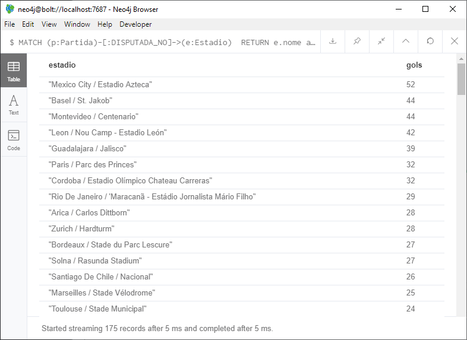
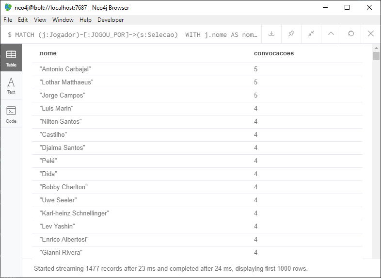

# Trabalho Neo4J

**334409 - Charles Guimarães Cavalcante**


## Carregar o Banco com os Scripts:

**1-Load_Matches_neo4j.txt**  
```
Added 1075 labels, created 1075 nodes, set 5726 properties, created 5443 relationships, completed after 2177 ms.
```

**2-Load_Squads_neo4j.txt**  
```
Added 7213 labels, created 7213 nodes, set 14035 properties, created 9385 relationships, completed after 28782 ms.
```

**3-Load_LineUps_neo4j.txt**  
```
Created 33937 nodes, created 67874 relationships, completed after 35696 ms.
```

**4-Load_Events_neo4j.txt**  
```
Added 150 labels, created 204 nodes, set 408 properties, created 204 relationships, completed after 2359 ms.
```

## Elaborar consultas para:

### Estádios com mais gols

**Query**
```
MATCH (p:Partida)-[:DISPUTADA_NO]->(e:Estadio) 
RETURN e.nome as estadio, 
       SUM(toInteger(p.placar_casa)) + 
       SUM(toInteger(p.placar_visitante)) AS gols
ORDER BY gols DESC
```

**Resultado**  


### Jogadores que participaram em mais do que uma copa

**Query**  
```
MATCH (j:Jogador)-[:JOGOU_POR]->(s:Selecao) 
WITH j.nome AS nome, COUNT(*) AS convocacoes
WHERE convocacoes > 1
RETURN nome, convocacoes
ORDER BY convocacoes DESC
```

**Resultado**  
