# Aula 2 – Ingestão de Dados com Sqoop

334409 - Charles Cavalcante

## Exercício 1: Reconhecimento do Ambiente e Importação – MySQL -> HDFS

```
sqoop import --connect jdbc:mysql://quickstart:3306/retail_db --table products --warehouse-dir /user/mysql --delete-target-dir --username root --password cloudera --where "product_price > 100"
```

### Número de registros no MySQL
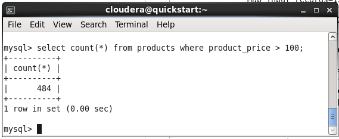

### Saída do sqoop
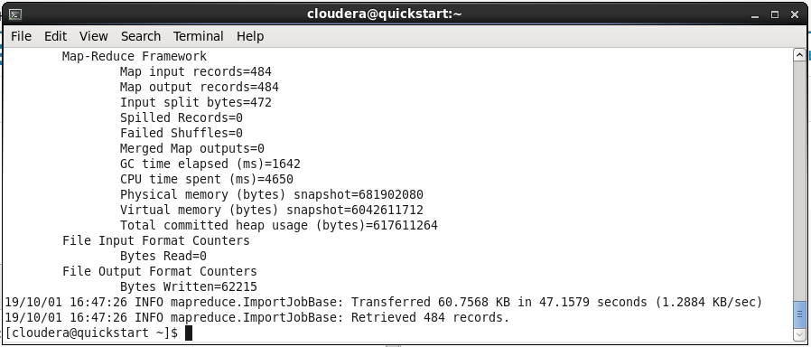


## Exercício 2: Exportação – HDFS -> MySQL

### Saída do sqoop
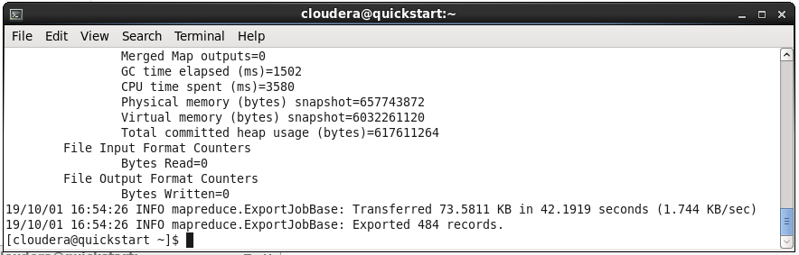

### Número de registros no MySQL
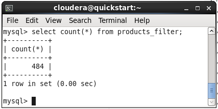


## Exercício 3: Otimização do processo de importação

### Importação da tabela “customers” (52.056 segundos)
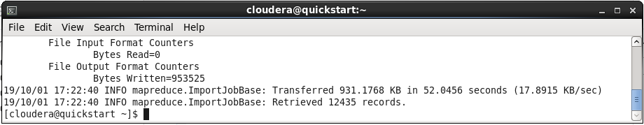

### Importação da tabela “customers” utilizando a opção “split-by”  (48.9813 segundos)
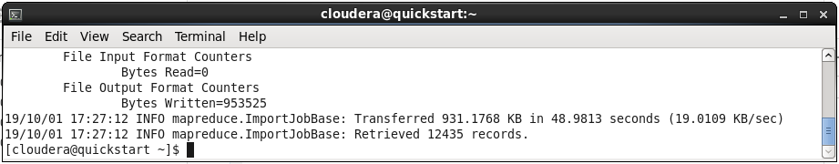

### Foram gerados 4 mappers
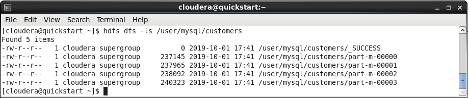

### Importação da tabela “customers” utilizando a opção num-mappers=10  (98.7485 segundos)
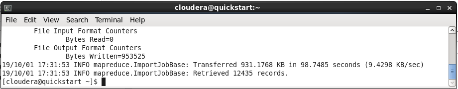

### Foram gerados 10 mappers
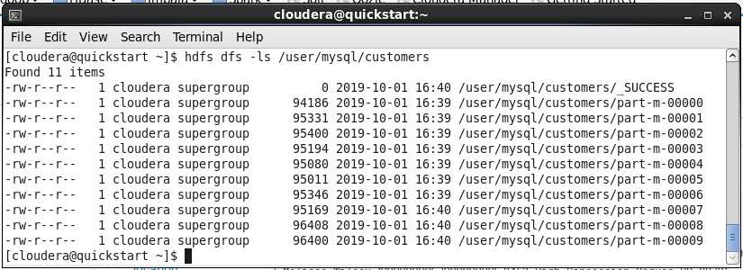


## Exercício 4: Importação com camada de metadados no HIVE

### Saída do sqoop
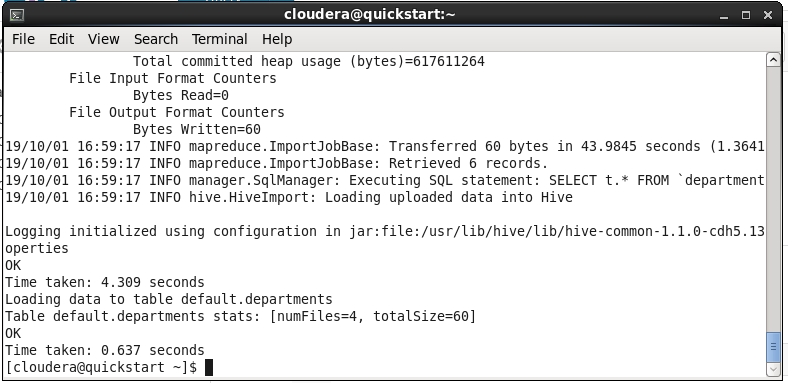

### Verificação no Hive
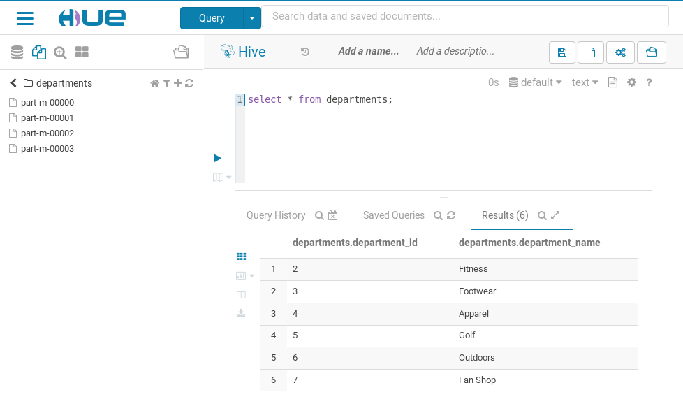


## Desafio

### Importação da tabela orders para o Hive com split pela chave da tabela (order_id)

```
sqoop import --connect jdbc:mysql://quickstart:3306/retail_db --table orders --target-dir /user/mysql/order_groups --hive-import --hive-table orders --delete-target-dir --split-by order_id --username root --password cloudera
```

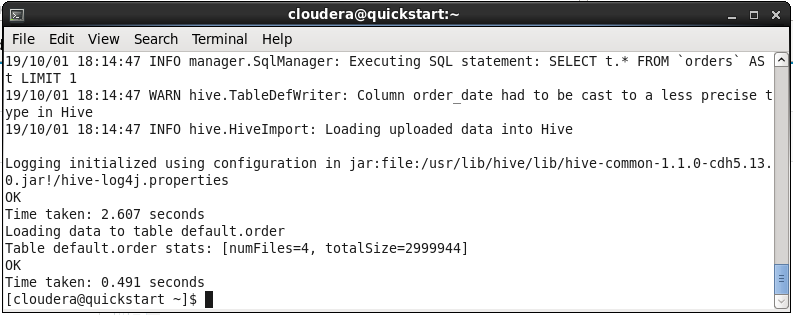

### Importação via sqoop de uma tabela nova chamada orders_group, oriunda de uma agregação feita na order_items, sumarizando o valor da venda. Faça o split pela chave estrangeira order_item_order_id

#### query que será utilizada
```
SELECT order_item_order_id, SUM(order_item_subtotal) AS order_item_total FROM order_items GROUP BY order_item_order_id;
```

#### comando no sqoop
```
sqoop import --connect jdbc:mysql://quickstart:3306/retail_db --query 'SELECT order_item_order_id, SUM(order_item_subtotal) AS order_item_total FROM order_items WHERE $CONDITIONS GROUP BY order_item_order_id' --hive-import --hive-table order_groups --delete-target-dir --split-by  order_item_order_id --username root --password cloudera
```

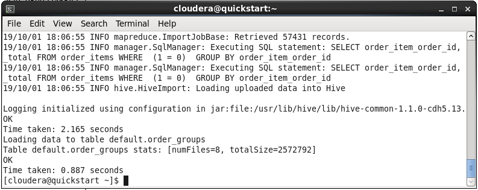

## Resultados Esperados

### 1) Tabela orders

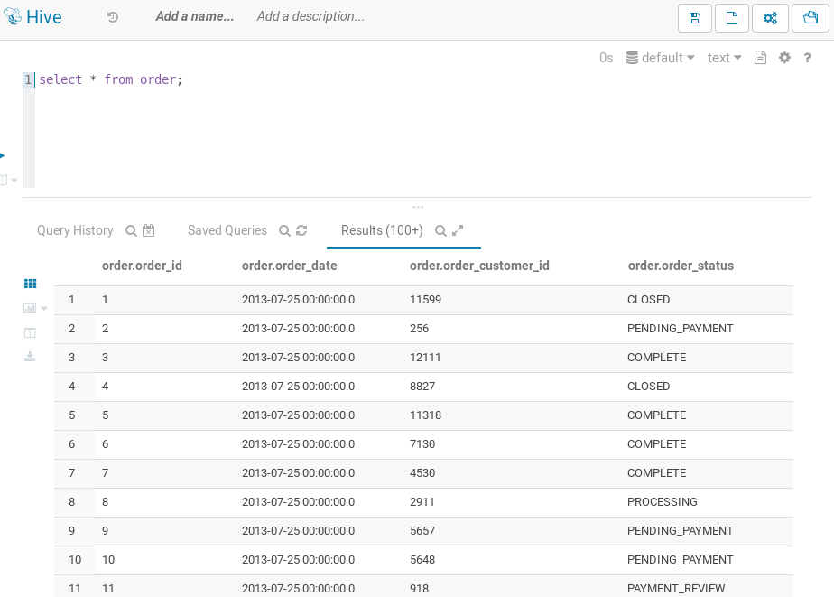

### 2) Tabela orders_group

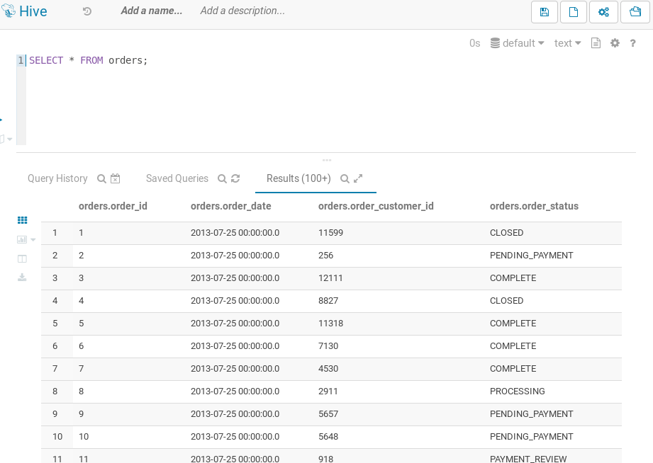

### 3) Pedidos agrupados com a data em que ocorreram

```
SELECT orders.order_id, orders.order_date, order_groups.order_item_total 
FROM orders
INNER JOIN order_groups ON orders.order_id = order_groups.order_item_order_id;
```

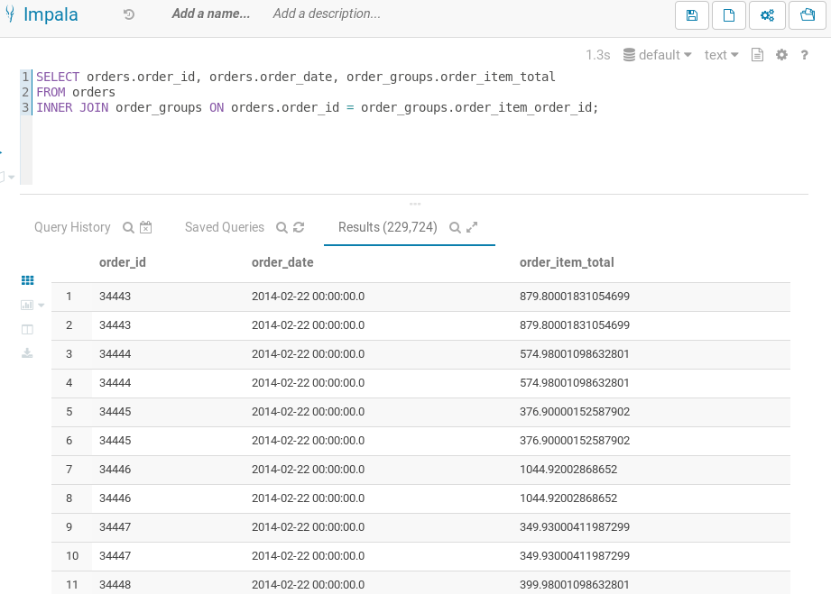

P.S. a consulta no Impala demorou 1.2 segundos, a mesma consulta no Hive demorou 38.4 segundos.